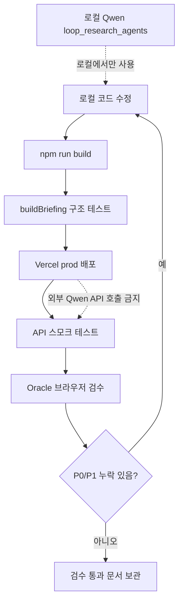

# Oracle 검수 루프 사용법

이 문서는 `tv-local-macro-onchain-vercel` 대시보드를 배포한 뒤 Oracle 브라우저 검수로 누락 구현을 찾고, 수정 후 다시 배포하는 반복 절차를 고정한다.

## 목적

- Oracle이 실제 배포 URL을 열어 대시보드가 보이는지 확인한다.
- `/api/registry`, `/api/series`, `/api/briefing`, `/api/cron`, `/api/history`가 목표 구조를 만족하는지 검수한다.
- 4개 Yonsei_dent 문서 기반 브리핑이 지표 전수 순회, 근거 ID, 차트 오버레이, 시나리오까지 연결되는지 확인한다.

## 전제

- Qwen은 외부 API를 쓰지 않는다.
- Qwen 보강은 로컬에서만 `loop_research_agents` 방식으로 실행한다.
- Vercel 배포본은 deterministic briefing과 공개 데이터 수집, cron 히스토리, 차트 렌더링만 담당한다.
- Oracle은 Chrome 로그인 세션을 사용한다.

## 1. 로컬 구조 테스트

```bash
cd /home/hang010412/kmw/klines_1m/deploy/tv-local-macro-onchain-vercel
npm run build
node -e "const lib=require('./api/_lib'); lib.buildBriefing('local_struct_test', true).then(b=>console.log(JSON.stringify({records:b.contexts.indicator_traversal.records.length,models:b.onchain_price_models.length,bands:b.price_bands.length,horizons:b.horizons.length,qwen:b.agent_chain.qwen.status}, null, 2)))"
```

통과 기준:

- `records`가 registry 전체 개수와 같다.
- `models`에 RP/STH RP/LTH RP/CVDD/Balanced/Difficulty가 있다.
- `bands`에 URPD/비용기준 밴드가 있다.
- `horizons`가 H0/H1/H2/H3 4개다.
- `qwen`은 Vercel 구조에서는 `skipped_in_vercel`이어야 한다.
- `indicator_traversal.records[*].metric_status`는 `live_value`, `manual_snapshot`, `proxy`, `missing` 중 하나여야 한다.
- horizon 카드에는 `used_metrics`, `missing_metrics`, `confidence_reason`이 있어야 한다.

## 2. 배포

```bash
npx -y vercel@latest deploy --yes --prod
```

배포 후 URL을 기록한다. 프로젝트 별칭이 유지되면 아래 URL을 우선 검수한다.

```text
https://tv-local-macro-onchain-vercel.vercel.app
```

## 3. API 스모크 테스트

```bash
BASE=https://tv-local-macro-onchain-vercel.vercel.app
curl -fsS "$BASE/api/registry" >/tmp/registry.json
curl -fsS "$BASE/api/series" >/tmp/series.json
curl -fsS "$BASE/api/briefing?session=smoke&qwen=1" >/tmp/briefing.json
curl -fsS "$BASE/api/cron?session=manual_oracle_loop" >/tmp/cron.json
curl -fsS "$BASE/api/history" >/tmp/history.json
```

확인할 핵심:

- `/api/briefing`의 `agent_chain.qwen.status`는 `skipped_in_vercel`.
- `contexts.indicator_traversal.records`는 전수 항목이다.
- `briefing_sections`, `scenarios`, `horizons`에는 `evidence_ids`가 있다.
- `onchain_price_models`, `price_bands`, `event_markers`, `lower_panels`가 존재한다.
- `source_image_mapping`이 004/005/021/036 원문 이미지의 구현/누락 대응표를 제공한다.
- `manual_snapshots`가 RP/STH RP/LTH RP/CVDD/Balanced/Difficulty/URPD/ATS/Whale/Exchange/Liveliness/CDD/Revived/RHODL/HODL Waves의 주입 포맷을 제공한다.

## 4. Oracle 검수 실행

```bash
PATH="$HOME/.local/bin:$PATH" ./scripts/run_oracle_dashboard_review.sh https://tv-local-macro-onchain-vercel.vercel.app
```

스크립트는 `oracle_reviews/oracle_dashboard_review_YYYYMMDD_HHMMSS.md`를 생성한다.

## 5. 판정 기준

통과로 볼 수 있는 상태:

- “전수 분석 대시보드가 아니다”라는 P0 지적이 사라진다.
- 온체인 가격모델이 BTC 차트 수평선으로 표현된다고 확인된다.
- URPD/비용기준 밴드가 차트 또는 대시보드에 보인다고 확인된다.
- CPI/NFP/DXY/VIX/금리 축 혼합 문제가 z-score 또는 별도 축으로 완화됐다고 확인된다.
- 브리핑 문장/시나리오/horizon에 근거 ID가 붙어 있다고 확인된다.
- cron 결과 저장 또는 히스토리 노출이 확인된다.

실패 시:

- Oracle 문서의 P0/P1 누락을 `api/_lib.js`, `public/index.html`, `public/static/js/macro_onchain.js`, `public/static/css/macro_onchain.css`에 반영한다.
- 다시 `npm run build`, 배포, API 스모크, Oracle 검수를 반복한다.

## Mermaid 흐름


